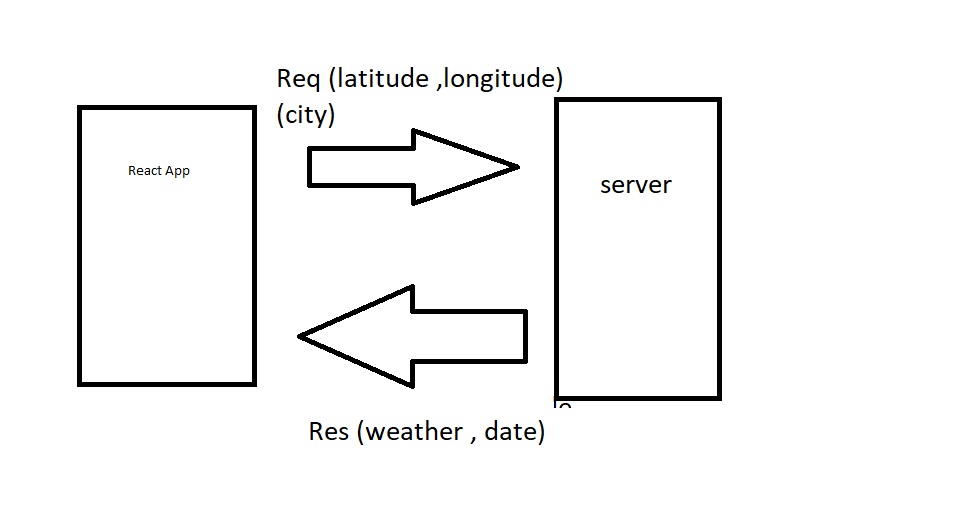

# city-explorer-api

# request-response cycle

# city-explorer-api

**Author**: Ismail Al Amir
**Version**: v1.0.0

## Overview
backend server req a lat,lon and res weather and date

## Getting Started
 planning what we need to do ,
 management the time ,
 start coding.

## Architecture
node.js

## Change Log

29-08-2022 10:00pm - Application now has a fully-functional express server.

## Credit and Collaborations
[Abdallah Mosa](https://github.com/AbdallahMosa)
  I really appreciate his collaborations.

## Time Estimates

1. Name of feature: Set up your server repository.

Estimate of time needed to complete: 30 min

Start time: 2:00 pm

Finish time: 3:00 pm

Actual time needed to complete: 1 hrs 

2. Name of feature: Weather (placeholder)

Estimate of time needed to complete: 1 hr

Start time: 3:00 pm

Finish time: 4:00 pm

Actual time needed to complete: 1 hrs 

3. Name of feature: Errors (revisited)

Estimate of time needed to complete: 30 min

Start time: 4:00 pm

Finish time: 4:30 pm

Actual time needed to complete: 30min
